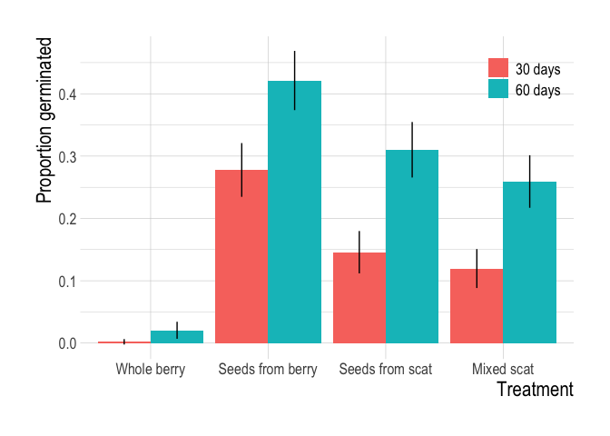
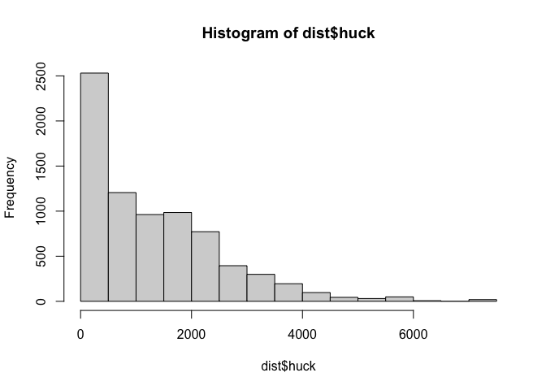
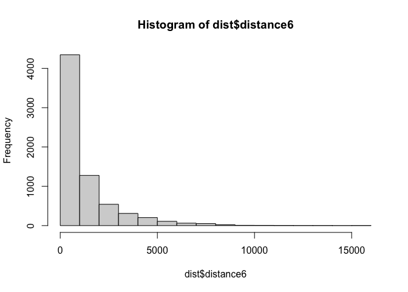
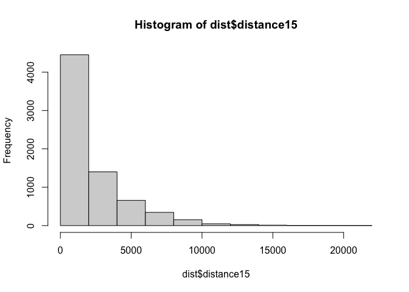

Effects of Bear Endozoochory on Germination and Disperal
================
Clayton T. Lamb
26 August, 2024

# Purpose

Task 1: Analyze the effect of four experimental treatments on
germination success of black huckleberry to better understand the effect
of bear endozoochory. The four treatments were A) Whole Berry: a single,
whole berry, B) Seeds from Berry: seeds extracted from a berry, C) Seeds
from Scat: seeds extracted from scat, D) Mixed Scat: seeds and scat.
Multiple seeds for each treatments were taken from the same sample (scat
or sampling area), thus we included a random effect for sample ID to
account for this nested data structure.

Task 2: Assess the movement rates of grizzly bears feeding in
huckleberry patches to estimate potential seed dispersal.

## Load packages and data

``` r
## load packages
library(renv)
library(readxl)
library(janitor)
library(lme4)
library(sjPlot)
library(ggeffects)
library(knitr)
library(hrbrthemes)
library(forcats)
library(sf)
library(lubridate)
library(terra)
library(emmeans)
library(multcomp)
library(tidyverse)


## Mixed effects modelling
df <- read_excel("data/Raw_Data_Huck_Thesis.xlsx", sheet = "60 Day Raw Data") %>%
  clean_names() %>%
  select(tray:total_seedlings) %>%
  mutate(days = 60) %>%
  rbind(
    read_excel("data/Raw_Data_Huck_Thesis.xlsx", sheet = "30 Day Raw Data") %>%
      clean_names() %>%
      select(tray:total_seedlings) %>%
      mutate(days = 30)
  ) %>%
  drop_na()
```

\#Task 1: Analyze germination experiment \## Prep data for analysis

``` r
## add in number of seeds used for each trial and trial names
seed.n <- tibble(
  treatment = c("A", "B", "C", "D"),
  n_seeds = c(27, 4, 4, 12),
  name= c("Whole berry", "Seeds from berry", "Seeds from scat", "Mixed scat")
)

df <- df %>%
  left_join(seed.n, by = "treatment") %>%
  mutate(no.germ = n_seeds - total_seedlings,
         name=fct_reorder(name, treatment%>%as.factor%>%as.numeric))%>%
  mutate(name_compress=str_remove_all(name," "))%>%
  mutate(name_compress=fct_relevel(name_compress,c("Wholeberry", "Seedsfromberry", "Seedsfromscat", "Mixedscat")))


## fix a few negatives
df <- df %>%
  mutate(total_seedlings = case_when(
    no.germ < 0 ~ n_seeds,
    TRUE ~ total_seedlings
  )) %>%
  mutate(
    no.germ = n_seeds - total_seedlings,
    prop.germ = total_seedlings / n_seeds
  )

##add days and treatment as a factor
df <- df%>%
  mutate(days.factor=paste0(as.factor(days), " days"))

##set up random effects
df <-df%>%
  mutate(jiffy=paste0(tray,number,letter),
         units=case_when(name%in%c("Seeds from berry", "Whole berry")~jiffy, TRUE~id))

## summary stats
summar.stats <- df %>%
  group_by(name, days.factor, treatment) %>%
  summarise(seedlings=sum(total_seedlings),
            seeds=sum(n_seeds),
            prop.germinated = (seedlings / seeds),
            perc.germinated = prop.germinated * 100,
            perc.germinated.bypot = mean(prop.germ) * 100,
            n=n(),
            se.prop=sqrt((prop.germinated*(1-prop.germinated))/n()),
            n_id=n_distinct(id),
            n_units=n_distinct(units),
            n_jiffy=n_distinct(jiffy)
            )

##plot
ggplot(summar.stats, aes(x=name, y=prop.germinated, ymin=prop.germinated-se.prop, ymax=prop.germinated+se.prop, fill=days.factor))+
  geom_col(position = position_dodge(width=0.9))+
  geom_linerange(position = position_dodge(width=0.9))+
  theme_ipsum()+
  labs(x="Treatment", y="Proportion germinated", fill="")+
  theme(legend.position = c(0.9,0.9),
        axis.title.x = element_text(size=17),
        axis.title.y = element_text(size=17),
        axis.text.x = element_text(size=13),
        axis.text.y = element_text(size=13),
        legend.text = element_text(size=13),
        plot.title = element_text(size=22),
        plot.subtitle = element_text(size=17))
```

<!-- -->

``` r
ggsave("plots/barplot.png", width=8, heigh=5, units="in", dpi=300, bg="white")
```

## Model

## with random effect accounting for the nested structure of data \[repeat samples from same berry or scat)

``` r
# fit random effect model that accounts for id via a nested random effect of id on the intercept
m1 <- glmer(prop.germ ~ name_compress + days.factor + (1|id/jiffy), family = "binomial", weights = n_seeds, data = df)
summary(m1)
```

    ## Generalized linear mixed model fit by maximum likelihood (Laplace
    ##   Approximation) [glmerMod]
    ##  Family: binomial  ( logit )
    ## Formula: prop.germ ~ name_compress + days.factor + (1 | id/jiffy)
    ##    Data: df
    ## Weights: n_seeds
    ## 
    ##      AIC      BIC   logLik deviance df.resid 
    ##   1946.6   1979.9   -966.3   1932.6      857 
    ## 
    ## Scaled residuals: 
    ##     Min      1Q  Median      3Q     Max 
    ## -1.7767 -0.4331 -0.1920  0.2165  2.0930 
    ## 
    ## Random effects:
    ##  Groups   Name        Variance Std.Dev.
    ##  jiffy:id (Intercept) 1.9728   1.4046  
    ##  id       (Intercept) 0.5694   0.7546  
    ## Number of obs: 864, groups:  jiffy:id, 432; id, 9
    ## 
    ## Fixed effects:
    ##                             Estimate Std. Error z value Pr(>|z|)    
    ## (Intercept)                 -7.20250    0.53365 -13.497  < 2e-16 ***
    ## name_compressSeedsfromberry  5.63819    0.33237  16.964  < 2e-16 ***
    ## name_compressSeedsfromscat   4.76079    0.63230   7.529 5.10e-14 ***
    ## name_compressMixedscat       4.03821    0.63271   6.382 1.74e-10 ***
    ## days.factor60 days           1.28649    0.08927  14.412  < 2e-16 ***
    ## ---
    ## Signif. codes:  0 '***' 0.001 '**' 0.01 '*' 0.05 '.' 0.1 ' ' 1
    ## 
    ## Correlation of Fixed Effects:
    ##                  (Intr) nm_cmprssSdsfrmb nm_cmprssSdsfrms nm_cmM
    ## nm_cmprssSdsfrmb -0.494                                         
    ## nm_cmprssSdsfrms -0.816  0.391                                  
    ## nm_cmprssMx      -0.816  0.391            0.926                 
    ## dys.fctr60d      -0.165  0.103            0.042            0.035

``` r
# plot odds ratios
sjPlot::plot_model(m1,
  show.values = TRUE, show.p = TRUE,
  title = "Effect of Treatment on Germination, w/ Random Effect for Sample"
)
```

<!-- -->

``` r
# model table
sjPlot::tab_model(m1)
```

<table style="border-collapse:collapse; border:none;">
<tr>
<th style="border-top: double; text-align:center; font-style:normal; font-weight:bold; padding:0.2cm;  text-align:left; ">
 
</th>
<th colspan="3" style="border-top: double; text-align:center; font-style:normal; font-weight:bold; padding:0.2cm; ">
prop germ
</th>
</tr>
<tr>
<td style=" text-align:center; border-bottom:1px solid; font-style:italic; font-weight:normal;  text-align:left; ">
Predictors
</td>
<td style=" text-align:center; border-bottom:1px solid; font-style:italic; font-weight:normal;  ">
Odds Ratios
</td>
<td style=" text-align:center; border-bottom:1px solid; font-style:italic; font-weight:normal;  ">
CI
</td>
<td style=" text-align:center; border-bottom:1px solid; font-style:italic; font-weight:normal;  ">
p
</td>
</tr>
<tr>
<td style=" padding:0.2cm; text-align:left; vertical-align:top; text-align:left; ">
(Intercept)
</td>
<td style=" padding:0.2cm; text-align:left; vertical-align:top; text-align:center;  ">
0.00
</td>
<td style=" padding:0.2cm; text-align:left; vertical-align:top; text-align:center;  ">
0.00 – 0.00
</td>
<td style=" padding:0.2cm; text-align:left; vertical-align:top; text-align:center;  ">
<strong>\<0.001</strong>
</td>
</tr>
<tr>
<td style=" padding:0.2cm; text-align:left; vertical-align:top; text-align:left; ">
name compress<br>\[Seedsfromberry\]
</td>
<td style=" padding:0.2cm; text-align:left; vertical-align:top; text-align:center;  ">
280.95
</td>
<td style=" padding:0.2cm; text-align:left; vertical-align:top; text-align:center;  ">
146.46 – 538.95
</td>
<td style=" padding:0.2cm; text-align:left; vertical-align:top; text-align:center;  ">
<strong>\<0.001</strong>
</td>
</tr>
<tr>
<td style=" padding:0.2cm; text-align:left; vertical-align:top; text-align:left; ">
name compress<br>\[Seedsfromscat\]
</td>
<td style=" padding:0.2cm; text-align:left; vertical-align:top; text-align:center;  ">
116.84
</td>
<td style=" padding:0.2cm; text-align:left; vertical-align:top; text-align:center;  ">
33.84 – 403.45
</td>
<td style=" padding:0.2cm; text-align:left; vertical-align:top; text-align:center;  ">
<strong>\<0.001</strong>
</td>
</tr>
<tr>
<td style=" padding:0.2cm; text-align:left; vertical-align:top; text-align:left; ">
name compress \[Mixedscat\]
</td>
<td style=" padding:0.2cm; text-align:left; vertical-align:top; text-align:center;  ">
56.72
</td>
<td style=" padding:0.2cm; text-align:left; vertical-align:top; text-align:center;  ">
16.41 – 196.04
</td>
<td style=" padding:0.2cm; text-align:left; vertical-align:top; text-align:center;  ">
<strong>\<0.001</strong>
</td>
</tr>
<tr>
<td style=" padding:0.2cm; text-align:left; vertical-align:top; text-align:left; ">
days factor \[60 days\]
</td>
<td style=" padding:0.2cm; text-align:left; vertical-align:top; text-align:center;  ">
3.62
</td>
<td style=" padding:0.2cm; text-align:left; vertical-align:top; text-align:center;  ">
3.04 – 4.31
</td>
<td style=" padding:0.2cm; text-align:left; vertical-align:top; text-align:center;  ">
<strong>\<0.001</strong>
</td>
</tr>
<tr>
<td colspan="4" style="font-weight:bold; text-align:left; padding-top:.8em;">
Random Effects
</td>
</tr>
<tr>
<td style=" padding:0.2cm; text-align:left; vertical-align:top; text-align:left; padding-top:0.1cm; padding-bottom:0.1cm;">
σ<sup>2</sup>
</td>
<td style=" padding:0.2cm; text-align:left; vertical-align:top; padding-top:0.1cm; padding-bottom:0.1cm; text-align:left;" colspan="3">
3.29
</td>
</tr>
<tr>
<td style=" padding:0.2cm; text-align:left; vertical-align:top; text-align:left; padding-top:0.1cm; padding-bottom:0.1cm;">
τ<sub>00</sub> <sub>jiffy:id</sub>
</td>
<td style=" padding:0.2cm; text-align:left; vertical-align:top; padding-top:0.1cm; padding-bottom:0.1cm; text-align:left;" colspan="3">
1.97
</td>
<tr>
<td style=" padding:0.2cm; text-align:left; vertical-align:top; text-align:left; padding-top:0.1cm; padding-bottom:0.1cm;">
τ<sub>00</sub> <sub>id</sub>
</td>
<td style=" padding:0.2cm; text-align:left; vertical-align:top; padding-top:0.1cm; padding-bottom:0.1cm; text-align:left;" colspan="3">
0.57
</td>
<tr>
<td style=" padding:0.2cm; text-align:left; vertical-align:top; text-align:left; padding-top:0.1cm; padding-bottom:0.1cm;">
ICC
</td>
<td style=" padding:0.2cm; text-align:left; vertical-align:top; padding-top:0.1cm; padding-bottom:0.1cm; text-align:left;" colspan="3">
0.44
</td>
<tr>
<td style=" padding:0.2cm; text-align:left; vertical-align:top; text-align:left; padding-top:0.1cm; padding-bottom:0.1cm;">
N <sub>jiffy</sub>
</td>
<td style=" padding:0.2cm; text-align:left; vertical-align:top; padding-top:0.1cm; padding-bottom:0.1cm; text-align:left;" colspan="3">
432
</td>
<tr>
<td style=" padding:0.2cm; text-align:left; vertical-align:top; text-align:left; padding-top:0.1cm; padding-bottom:0.1cm;">
N <sub>id</sub>
</td>
<td style=" padding:0.2cm; text-align:left; vertical-align:top; padding-top:0.1cm; padding-bottom:0.1cm; text-align:left;" colspan="3">
9
</td>
<tr>
<td style=" padding:0.2cm; text-align:left; vertical-align:top; text-align:left; padding-top:0.1cm; padding-bottom:0.1cm; border-top:1px solid;">
Observations
</td>
<td style=" padding:0.2cm; text-align:left; vertical-align:top; padding-top:0.1cm; padding-bottom:0.1cm; text-align:left; border-top:1px solid;" colspan="3">
864
</td>
</tr>
<tr>
<td style=" padding:0.2cm; text-align:left; vertical-align:top; text-align:left; padding-top:0.1cm; padding-bottom:0.1cm;">
Marginal R<sup>2</sup> / Conditional R<sup>2</sup>
</td>
<td style=" padding:0.2cm; text-align:left; vertical-align:top; padding-top:0.1cm; padding-bottom:0.1cm; text-align:left;" colspan="3">
0.466 / 0.699
</td>
</tr>
</table>

``` r
# pairwise significance
#emmeans(m1, list(pairwise ~ name_compress), adjust = "tukey")$`pairwise differences of name` %>% kable()
summary(glht(m1, linfct=c("name_compressSeedsfromberry - name_compressSeedsfromscat == 0",
                          "name_compressSeedsfromscat - name_compressMixedscat == 0")))
```

    ## 
    ##   Simultaneous Tests for General Linear Hypotheses
    ## 
    ## Fit: glmer(formula = prop.germ ~ name_compress + days.factor + (1 | 
    ##     id/jiffy), data = df, family = "binomial", weights = n_seeds)
    ## 
    ## Linear Hypotheses:
    ##                                                               Estimate
    ## name_compressSeedsfromberry - name_compressSeedsfromscat == 0   0.8774
    ## name_compressSeedsfromscat - name_compressMixedscat == 0        0.7226
    ##                                                               Std. Error
    ## name_compressSeedsfromberry - name_compressSeedsfromscat == 0     0.5881
    ## name_compressSeedsfromscat - name_compressMixedscat == 0          0.2427
    ##                                                               z value Pr(>|z|)
    ## name_compressSeedsfromberry - name_compressSeedsfromscat == 0   1.492   0.2498
    ## name_compressSeedsfromscat - name_compressMixedscat == 0        2.977   0.0058
    ##                                                                 
    ## name_compressSeedsfromberry - name_compressSeedsfromscat == 0   
    ## name_compressSeedsfromscat - name_compressMixedscat == 0      **
    ## ---
    ## Signif. codes:  0 '***' 0.001 '**' 0.01 '*' 0.05 '.' 0.1 ' ' 1
    ## (Adjusted p values reported -- single-step method)

## test for days since

``` r
# fit random effect model that accounts for id via a nested random effect of id on the intercept
m1_30 <- glmer(prop.germ ~ name_compress + (1|id/jiffy), family = "binomial", weights = n_seeds, data = df%>%filter(days==30))
summary(m1_30)
```

    ## Generalized linear mixed model fit by maximum likelihood (Laplace
    ##   Approximation) [glmerMod]
    ##  Family: binomial  ( logit )
    ## Formula: prop.germ ~ name_compress + (1 | id/jiffy)
    ##    Data: df %>% filter(days == 30)
    ## Weights: n_seeds
    ## 
    ##      AIC      BIC   logLik deviance df.resid 
    ##    900.1    924.6   -444.1    888.1      426 
    ## 
    ## Scaled residuals: 
    ##     Min      1Q  Median      3Q     Max 
    ## -0.9433 -0.5748 -0.1467  0.2532  2.3389 
    ## 
    ## Random effects:
    ##  Groups   Name        Variance Std.Dev.
    ##  jiffy:id (Intercept) 1.2527   1.1192  
    ##  id       (Intercept) 0.3632   0.6027  
    ## Number of obs: 432, groups:  jiffy:id, 432; id, 9
    ## 
    ## Fixed effects:
    ##                             Estimate Std. Error z value Pr(>|z|)    
    ## (Intercept)                  -7.3312     0.6526 -11.234  < 2e-16 ***
    ## name_compressSeedsfromberry   6.0991     0.5615  10.862  < 2e-16 ***
    ## name_compressSeedsfromscat    5.1404     0.7113   7.227 4.94e-13 ***
    ## name_compressMixedscat        4.5186     0.7049   6.410 1.45e-10 ***
    ## ---
    ## Signif. codes:  0 '***' 0.001 '**' 0.01 '*' 0.05 '.' 0.1 ' ' 1
    ## 
    ## Correlation of Fixed Effects:
    ##                  (Intr) nm_cmprssSdsfrmb nm_cmprssSdsfrms
    ## nm_cmprssSdsfrmb -0.807                                  
    ## nm_cmprssSdsfrms -0.891  0.715                           
    ## nm_cmprssMx      -0.894  0.716            0.934

``` r
# pairwise significance
#emmeans(m1_30, list(pairwise ~ name_compress), adjust = "tukey")$`pairwise differences of name` %>% kable()
summary(glht(m1_30, linfct=c("name_compressSeedsfromberry - name_compressSeedsfromscat == 0",
                          "name_compressSeedsfromscat - name_compressMixedscat == 0")))
```

    ## 
    ##   Simultaneous Tests for General Linear Hypotheses
    ## 
    ## Fit: glmer(formula = prop.germ ~ name_compress + (1 | id/jiffy), data = df %>% 
    ##     filter(days == 30), family = "binomial", weights = n_seeds)
    ## 
    ## Linear Hypotheses:
    ##                                                               Estimate
    ## name_compressSeedsfromberry - name_compressSeedsfromscat == 0   0.9586
    ## name_compressSeedsfromscat - name_compressMixedscat == 0        0.6218
    ##                                                               Std. Error
    ## name_compressSeedsfromberry - name_compressSeedsfromscat == 0     0.5000
    ## name_compressSeedsfromscat - name_compressMixedscat == 0          0.2579
    ##                                                               z value Pr(>|z|)
    ## name_compressSeedsfromberry - name_compressSeedsfromscat == 0   1.917   0.1051
    ## name_compressSeedsfromscat - name_compressMixedscat == 0        2.411   0.0311
    ##                                                                
    ## name_compressSeedsfromberry - name_compressSeedsfromscat == 0  
    ## name_compressSeedsfromscat - name_compressMixedscat == 0      *
    ## ---
    ## Signif. codes:  0 '***' 0.001 '**' 0.01 '*' 0.05 '.' 0.1 ' ' 1
    ## (Adjusted p values reported -- single-step method)

``` r
m1_60 <- glmer(prop.germ ~ name_compress + (1|id/jiffy), family = "binomial", weights = n_seeds, data = df%>%filter(days==60))
summary(m1_60)
```

    ## Generalized linear mixed model fit by maximum likelihood (Laplace
    ##   Approximation) [glmerMod]
    ##  Family: binomial  ( logit )
    ## Formula: prop.germ ~ name_compress + (1 | id/jiffy)
    ##    Data: df %>% filter(days == 60)
    ## Weights: n_seeds
    ## 
    ##      AIC      BIC   logLik deviance df.resid 
    ##   1257.4   1281.8   -622.7   1245.4      426 
    ## 
    ## Scaled residuals: 
    ##     Min      1Q  Median      3Q     Max 
    ## -1.1217 -0.4291 -0.2170  0.2182  1.7094 
    ## 
    ## Random effects:
    ##  Groups   Name        Variance Std.Dev.
    ##  jiffy:id (Intercept) 1.6427   1.2817  
    ##  id       (Intercept) 0.6941   0.8331  
    ## Number of obs: 432, groups:  jiffy:id, 432; id, 9
    ## 
    ## Fixed effects:
    ##                             Estimate Std. Error z value Pr(>|z|)    
    ## (Intercept)                  -5.4946     0.5600  -9.811  < 2e-16 ***
    ## name_compressSeedsfromberry   5.0648     0.3284  15.423  < 2e-16 ***
    ## name_compressSeedsfromscat    4.3196     0.6785   6.367 1.93e-10 ***
    ## name_compressMixedscat        3.5608     0.6760   5.267 1.38e-07 ***
    ## ---
    ## Signif. codes:  0 '***' 0.001 '**' 0.01 '*' 0.05 '.' 0.1 ' ' 1
    ## 
    ## Correlation of Fixed Effects:
    ##                  (Intr) nm_cmprssSdsfrmb nm_cmprssSdsfrms
    ## nm_cmprssSdsfrmb -0.438                                  
    ## nm_cmprssSdsfrms -0.817  0.348                           
    ## nm_cmprssMx      -0.819  0.347            0.934

``` r
# pairwise significance
#emmeans(m1_60, list(pairwise ~ name_compress), adjust = "tukey")$`pairwise differences of name` %>% kable()
summary(glht(m1_60, linfct=c("name_compressSeedsfromberry - name_compressSeedsfromscat == 0",
                          "name_compressSeedsfromscat - name_compressMixedscat == 0")))
```

    ## 
    ##   Simultaneous Tests for General Linear Hypotheses
    ## 
    ## Fit: glmer(formula = prop.germ ~ name_compress + (1 | id/jiffy), data = df %>% 
    ##     filter(days == 60), family = "binomial", weights = n_seeds)
    ## 
    ## Linear Hypotheses:
    ##                                                               Estimate
    ## name_compressSeedsfromberry - name_compressSeedsfromscat == 0   0.7452
    ## name_compressSeedsfromscat - name_compressMixedscat == 0        0.7588
    ##                                                               Std. Error
    ## name_compressSeedsfromberry - name_compressSeedsfromscat == 0     0.6428
    ## name_compressSeedsfromscat - name_compressMixedscat == 0          0.2454
    ##                                                               z value Pr(>|z|)
    ## name_compressSeedsfromberry - name_compressSeedsfromscat == 0   1.159  0.42753
    ## name_compressSeedsfromscat - name_compressMixedscat == 0        3.092  0.00396
    ##                                                                 
    ## name_compressSeedsfromberry - name_compressSeedsfromscat == 0   
    ## name_compressSeedsfromscat - name_compressMixedscat == 0      **
    ## ---
    ## Signif. codes:  0 '***' 0.001 '**' 0.01 '*' 0.05 '.' 0.1 ' ' 1
    ## (Adjusted p values reported -- single-step method)

# Germination Conclusion

Results suggest that A was much worse than all treatments (p\<0.001), C
was better than D (p\<0.005), and B was better than D (p=0.05). We did
not detect a significant difference between B and C (p=0.24).
Qualitatively B germinated more than C, and the effect size was actually
larger than for C to D, but statistically we didn’t have the sample
size/precision to resolve the difference between B and C.

\#Task 2: Analyze dispersal potential using collar data and gut
retention times

## load and clean telemetry data

``` r
ev.grizz <- read.csv(here::here("data","EVcollar_Relocs_raw.csv"))

ev.grizz<- ev.grizz%>%
  mutate(datetime=DateTime%>%ymd_hms(tz="MST"),
         sp="grizzlybear",
         study="EV_Grizz_Lamb",
         fixtype="3D",
         sensortype="gps",
         Name=as.character(Name),
         id_yr=paste(Name,year(datetime),sep="_"),
         season=case_when(month(datetime)<8~"early",TRUE~"late"),
         id_yr_ssn=paste(Name,year(datetime),season,sep="_"))%>%
  filter(month(datetime)%in%4:11, DOP<=10)%>%
  dplyr::select(sp,
                study,
                id=Name,
                id_yr,
                id_yr_ssn,
                datetime,
                lat=Latitude,
                long=Longitude,
                dop=DOP,
                fixtype,
                sensortype)%>%
  tibble()%>%
  mutate(loc.id <- 1:nrow(.))%>%
  st_as_sf(coords=c("long","lat"),
           crs=4326)%>%
  st_transform("+proj=aea +lat_0=45 +lon_0=-126 +lat_1=50 +lat_2=58.5 +x_0=1000000 +y_0=0 +ellps=GRS80 +towgs84=0,0,0,0,0,0,0 +units=m +no_defs")

##keep recent bears
ev.grizz <- ev.grizz%>%filter(year(datetime)>2015)

##keep only animal-years with >25 locations
keep <- ev.grizz%>%
  group_by(id_yr)%>%
  summarize(n=n())%>%
  filter(n>25)%>%
  pull(id_yr)

ev.grizz <- ev.grizz%>%filter(id_yr%in%keep)
```

## extract huckleberry data to points

``` r
##huck
huck <- terra::rast(here::here("data/VACCMEM_kcal.tif"))
#plot(elev)

##convert to terra raster 
pts.terra <- ev.grizz%>%terra::vect()

# extract
ev.grizz <-
  ev.grizz %>%
  mutate(huck = terra::extract(huck, pts.terra)[,2],
         month=month(datetime))


##summarise
ev.grizz%>%
  tibble%>%
  group_by(month)%>%
  summarise(mean=mean(huck))

#hist(ev.grizz$huck)

##select huck bears
huck.bears <-
  ev.grizz%>%
  tibble%>%
  filter(month==8)%>%
  group_by(id_yr)%>%
  summarise(mean=mean(huck))

#hist(huck.bears$mean)

huck.bears.keep<-huck.bears%>%
  filter(mean>800)

ev.grizz.huck<- ev.grizz%>%
  filter(month%in%c(8:9) & id_yr%in%huck.bears.keep$id_yr) ##select Aug and Sept
```

## analyze movements

``` r
##get step length and fix rate
dist <- ev.grizz.huck%>%
  group_by(id_yr)%>%
  arrange(datetime)%>%
  mutate(time=as.numeric(lead(datetime)-datetime,"hours"),
         distance=st_distance(lead(geometry), geometry, 
                              by_element = TRUE)%>%as.numeric())%>%
  filter(time<20)

#hist(dist$time)

dist <- dist%>%
  mutate(time6=case_when(as.numeric(lead(datetime,n=3)-datetime,"hours")%>%round(0)%in% 5:7~as.numeric(lead(datetime,n=3)-datetime,"hours"),
                          as.numeric(lead(datetime,n=1)-datetime,"hours")%>%round(0)%in% 5:7~as.numeric(lead(datetime,n=1)-datetime,"hours")),
         distance6=case_when(as.numeric(lead(datetime,n=3)-datetime,"hours")%>%round(0)%in% 5:7~st_distance(lead(geometry,n=3), geometry, 
                                                                                                               by_element = TRUE)%>%as.numeric(),
                              as.numeric(lead(datetime,n=1)-datetime,"hours")%>%round(0)%in% 5:7~st_distance(lead(geometry,n=1), geometry, 
                                                                                                               by_element = TRUE)%>%as.numeric()),
         
         time15=case_when(as.numeric(lead(datetime,n=7)-datetime,"hours")%>%round(0)%in% 12:18~as.numeric(lead(datetime,n=7)-datetime,"hours"),
                          as.numeric(lead(datetime,n=2)-datetime,"hours")%>%round(0)%in% 12:18~as.numeric(lead(datetime,n=2)-datetime,"hours")),
         distance15=case_when(as.numeric(lead(datetime,n=7)-datetime,"hours")%>%round(0)%in% 12:18~st_distance(lead(geometry,n=7), geometry, 
                                                                                                               by_element = TRUE)%>%as.numeric(),
                              as.numeric(lead(datetime,n=2)-datetime,"hours")%>%round(0)%in% 12:18~st_distance(lead(geometry,n=2), geometry, 
                                                                                                               by_element = TRUE)%>%as.numeric())
  )


hist(dist$huck)
```

<!-- -->

``` r
hist(dist$distance6)
```

<!-- -->

``` r
hist(dist$distance15)
```

<!-- -->

``` r
##get average step length
dist_stepped <- dist%>%
  tibble%>%
  filter(huck>1000)%>%
  group_by(month,id_yr)%>%
  mutate(speed=distance/time)%>%
  summarise_at(c("speed","time","distance"), mean, na.rm = TRUE)

# dist_stepped%>%
#   group_by(month)%>%
#   summarise_at(c("speed","time","distance"), mean, na.rm = TRUE)


dist_stepped6 <- dist%>%
  tibble%>%
  filter(huck>1000)%>%
  group_by(month,id_yr)%>%
  mutate(speed6=distance6/time6)%>%
  add_count()%>%
  summarise_at(c("time6","distance6","n"), c(mean=mean,max=max), na.rm = TRUE)%>%
  select(-n_max)%>%
  rename(n=n_mean)


dist_stepped6%>%
  select(-n, -contains("time"))%>%
  group_by(month)%>%
  summarise_at(c("distance6_mean","distance6_max"), c(mean=mean,sd=sd), na.rm = TRUE)


dist_stepped6.final <- dist_stepped6%>%
  select(-n)%>%
  ungroup%>%
  summarise_at(c("distance6_mean","distance6_max","time6_mean", "time6_max"), c(mean=mean,sd=sd), na.rm = TRUE)


dist_stepped15 <- dist%>%
  tibble%>%
  filter(huck>1000)%>%
  group_by(month,id_yr)%>%
  mutate(speed15=distance15/time15)%>%
  add_count()%>%
  summarise_at(c("time15","distance15","n"), c(mean=mean,max=max), na.rm = TRUE)%>%
  select(-n_max)%>%
  rename(n=n_mean)
  

dist_stepped15%>%
  select(-n, -contains("time"))%>%
  group_by(month)%>%
  summarise_at(c("distance15_mean","distance15_max"), c(mean=mean,sd=sd), na.rm = TRUE)


dist_stepped15%>%
  select(-n, -contains("time"))%>%
  ungroup%>%
  summarise_at(c("distance15_mean","distance15_max"), c(mean=mean,sd=sd), na.rm = TRUE)
```

## bootstrap

``` r
##bootstrap
boot.n <- 1000

##6 hour
dist_stepped6.dat <- dist%>%
  tibble%>%
  filter(huck>1000)%>%
  group_by(month,id_yr)%>%
  mutate(speed6=distance6/time6)%>%
  drop_na(speed6)%>%
  ungroup

dist_stepped6.boot <-tibble()
for(i in 1:boot.n){
a <- dist_stepped6.dat%>%
  sample_frac(1, replace=TRUE)%>%
  group_by(id_yr)%>%
  summarise(speed_yr=mean(speed6),
            speed_yr_max=max(speed6))%>%
  ungroup%>%
  summarise(speed=mean(speed_yr),
            speed_max=mean(speed_yr_max))%>%
  mutate(dist6=speed*6.25,
         dist6_max=speed_max*6.25)

dist_stepped6.boot <- rbind(dist_stepped6.boot,a)
}

dist_stepped6.boot%>%
  summarise_at(c("speed","dist6","dist6_max"), c(mean=mean,sd=sd), na.rm = TRUE)


##15 hour

dist_stepped15.dat <- dist%>%
  tibble%>%
  filter(huck>1000)%>%
  group_by(month,id_yr)%>%
  mutate(speed15=distance15/time15)%>%
  drop_na(speed15)%>%
  ungroup

dist_stepped15.boot <-tibble()
for(i in 1:boot.n){
  a <- dist_stepped15.dat%>%
    sample_frac(1, replace=TRUE)%>%
    group_by(id_yr)%>%
    summarise(speed_yr=mean(speed15),
              speed_yr_max=max(speed15))%>%
    ungroup%>%
    summarise(speed=mean(speed_yr),
              speed_max=mean(speed_yr_max))%>%
    mutate(dist15=speed*15.6,
           dist15_max=speed_max*15.6)
  
  dist_stepped15.boot <- rbind(dist_stepped15.boot,a)
}

dist_stepped15.boot%>%
  summarise_at(c("speed","dist15","dist15_max"), c(mean=mean,sd=sd), na.rm = TRUE)
```
